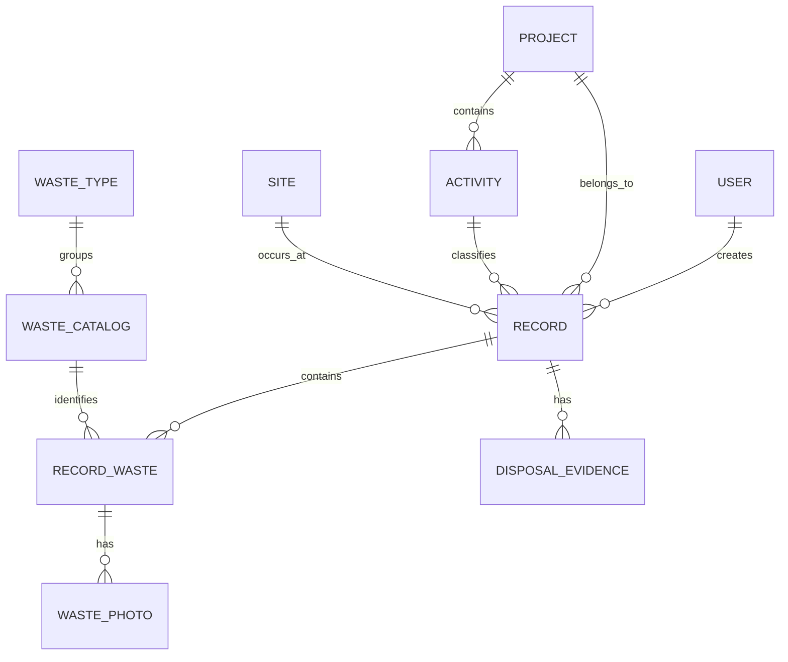

# Base de datos mobile-first

## Objetivo

La aplicación usa SQLite como fuente de datos local para que el flujo principal funcione aun sin conexión. La API remota se incorporará como capa de sincronización, no como requisito para poder registrar residuos en campo.

El archivo local es `reciclaapp.db3` y vive en `FileSystem.AppDataDirectory`.

## Principios de diseño

1. **Offline-first:** un registro se guarda primero en el teléfono y se encola para sincronización.
2. **IDs creados en el cliente:** todas las entidades usan UUID/GUID en texto. Así un registro puede existir offline y conservar el mismo ID al llegar al servidor.
3. **Soft delete:** las entidades sincronizables usan `DeletedAtUtc` en lugar de borrado inmediato.
4. **Control de versión:** `LocalRevision` y `RemoteRevision` dejan preparada la resolución de conflictos.
5. **Fechas UTC:** creación, actualización, captura y sincronización se guardan en UTC. La UI convierte a hora local.
6. **Archivos fuera de SQLite:** fotos y evidencias se guardan como archivos; la BD conserva ruta local, URL remota y metadatos. Esto evita inflar la base y reduce memoria/IO.
7. **Credenciales fuera de la BD:** nunca se almacena la contraseña. Cuando exista autenticación remota, los tokens deben guardarse con `SecureStorage`.
8. **WAL y timeout:** SQLite se abre con WAL, `synchronous=NORMAL` y `busy_timeout` para minimizar bloqueos en móvil.

## Modelo

### `users`

Perfil local del usuario. Contiene `Username`, `DisplayName`, correo opcional y fecha de último acceso. No contiene contraseña ni token.

### `projects`, `activities`, `sites`

Catálogos usados al iniciar un registro. `activities.ProjectId` permite actividades específicas de un proyecto o actividades generales si el campo queda vacío.

### `waste_types`, `waste_catalog`

Catálogo para el formulario de residuos. Cada residuo conoce su tipo, si es peligroso y su unidad por defecto.

### `records`

Cabecera del registro de residuos. Guarda usuario, proyecto, actividad, sede, fecha, estado (`Draft`/`Completed`) y metadatos de sincronización.

### `record_waste`

Detalle del residuo generado. Guarda cantidad, unidad, observación y relación con el catálogo.

### `waste_photos`

Fotos asociadas a un residuo. Guarda `LocalPath`, `RemoteUrl`, nombre, MIME type, tamaño, hash y fecha de captura.

### `disposal_evidence`

Evidencias de disposición asociadas al registro, con el mismo patrón de almacenamiento de archivos que las fotos.

### `sync_queue`

Cola de operaciones pendientes. Cada alta, edición, eliminación o archivo genera una operación con:

- entidad e ID;
- operación (`Upsert`, `Delete`, `UploadMedia`);
- reintentos;
- último error;
- próxima fecha de reintento;
- estado completado.

Los errores usan backoff exponencial para evitar gastar batería y datos cuando la red es inestable.

### `app_settings`

Metadatos pequeños de la aplicación: versión del esquema, usuario actual, registro en curso, residuo activo y marcas de sincronización.

## Flujo offline

1. El usuario inicia sesión. Solo el perfil se conserva en SQLite.
2. Proyecto, actividad y sede se leen de catálogos locales.
3. Al pulsar **Continuar**, se crea un `records` en estado `Draft` y una operación en `sync_queue` dentro de la misma transacción.
4. Cada residuo se inserta en `record_waste` y se encola.
5. Fotos/evidencias se copian al almacenamiento de la app y se guarda únicamente su metadata en SQLite.
6. Cuando existe conectividad, un servicio de sincronización procesa `sync_queue` en orden.
7. Al recibir confirmación del backend, se marca la operación como completada y la entidad como sincronizada.

## Política propuesta de conflictos

- **Catálogos:** el servidor es autoritativo.
- **Registros en borrador:** mientras no hayan sido aceptados por el servidor, prevalece la versión local más reciente.
- **Registros ya sincronizados:** comparar `RemoteRevision`; si cambió en ambos extremos, crear un conflicto explícito en vez de sobrescribir silenciosamente.
- **Fotos/evidencias:** tratarlas como objetos inmutables. Una edición se modela como eliminación + nueva carga.

## Backend recomendado

La base local no sustituye al backend. Para sincronización multiusuario conviene replicar el modelo en una base central como PostgreSQL, manteniendo los mismos IDs generados por el cliente. El servidor debe asignar una revisión/ETag a cada cambio y exponer endpoints incrementales de catálogos y registros.

## Migraciones

`DatabaseConstants.SchemaVersion` comienza en `1`. Los próximos cambios estructurales deben agregarse como migraciones incrementales y actualizar la versión solo después de completar cada migración. No se debe borrar la base para actualizar una app instalada porque podría contener registros todavía no sincronizados.
